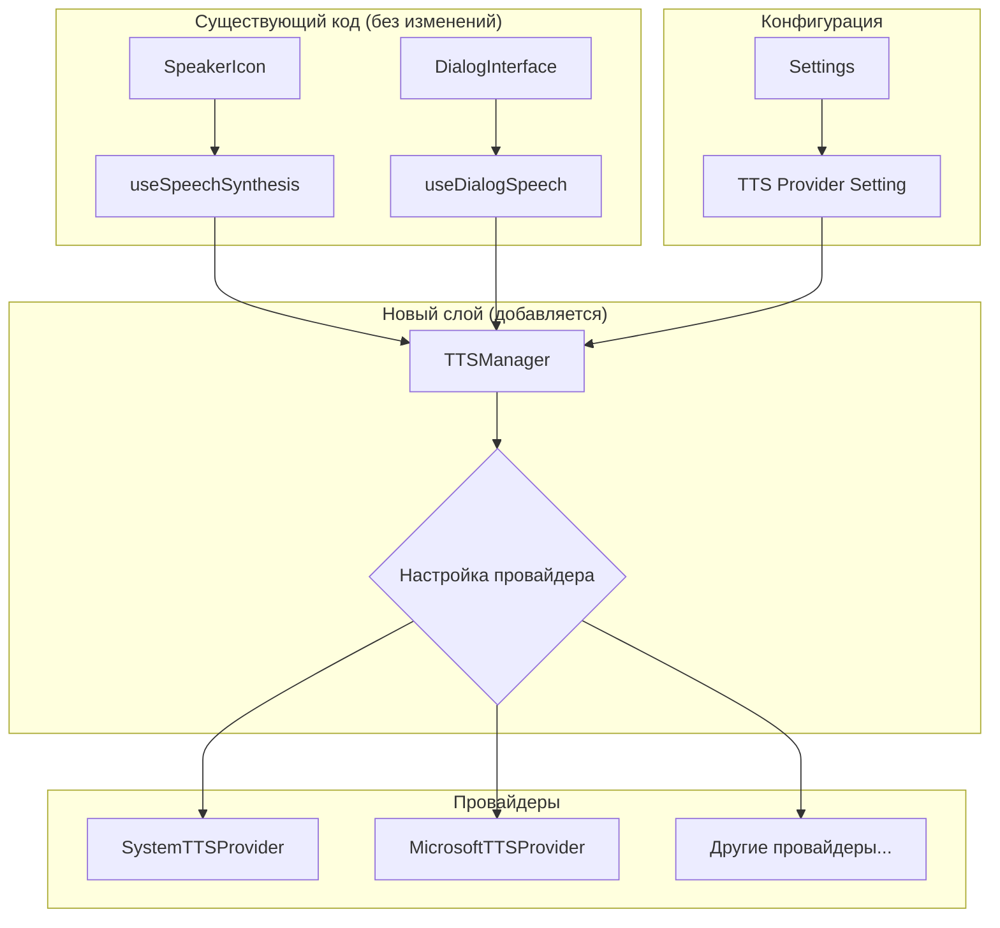

# Архитектура интеграции Microsoft Cognitive Services TTS

## Обзор

Этот документ описывает архитектуру интеграции множественных TTS провайдеров в React приложение для изучения иврита с минимальными изменениями существующего кода.

## Принципы дизайна

1. **Минимальные изменения** - существующий код остается практически неизменным
2. **Plugin-based подход** - легко добавлять новые TTS провайдеры
3. **Обратная совместимость** - по умолчанию работает как раньше
4. **Простая конфигурация** - настройка через Settings UI
5. **Graceful fallback** - автоматическое переключение на системный TTS при ошибках

## Архитектурная диаграмма



## Ключевые компоненты

### 1. TTSManager (Главный компонент)

Единый менеджер для управления всеми TTS провайдерами.

**Местоположение:** `src/services/tts/TTSManager.ts`

**Основные функции:**
- Управление текущим провайдером
- Fallback логика
- Кеширование аудио
- Единый API для всех хуков

**Интерфейс:**
```typescript
export type TTSProviderType = 'system' | 'microsoft' | 'elevenlabs' | 'google';

interface TTSManagerConfig {
  provider: TTSProviderType;
  fallbackToSystem: boolean;
  cacheEnabled: boolean;
  microsoftApiKey?: string;
  microsoftRegion?: string;
}

class TTSManager {
  static getInstance(): TTSManager;
  async speak(text: string, options: SpeechSynthesisUtterance): Promise<void>;
}
```

### 2. Модификации существующих хуков

**useSpeechSynthesis** - изменение в 1 строке:
```typescript
// Вместо:
window.speechSynthesis.speak(utterance);

// Становится:
const ttsManager = TTSManager.getInstance();
await ttsManager.speak(text, utterance);
```

**useDialogSpeech** - аналогичное изменение в методе `playCard()`

### 3. TTS Settings UI

**Местоположение:** `src/components/settings/TTSSettings.tsx`

**Функции:**
- Выбор TTS провайдера
- Настройка API ключей
- Включение/отключение fallback
- Управление кешированием

## Поддерживаемые провайдеры

### System TTS (Браузерный)
- **Статус:** Готов (существующий функционал)
- **Языки:** Зависит от браузера и ОС
- **Стоимость:** Бесплатно
- **Качество:** Базовое

### Microsoft Cognitive Services TTS
- **Статус:** Планируется к реализации
- **Языки:** Автоматическое определение (иврит, русский, английский)
- **Стоимость:** 500,000 символов бесплатно/месяц
- **Качество:** Высокое
- **Конфигурация:** API ключ + регион в localStorage

### Будущие провайдеры
- **ElevenLabs:** Премиум качество
- **Google TTS:** Альтернативный облачный провайдер
- **Amazon Polly:** Еще один облачный вариант

## Автоматическое определение языка

```typescript
class LanguageDetector {
  detect(text: string): string {
    // Иврит: [\u0590-\u05FF]
    if (/[\u0590-\u05FF]/.test(text)) return 'he-IL';
    
    // Русский: [\u0400-\u04FF]
    if (/[\u0400-\u04FF]/.test(text)) return 'ru-RU';
    
    // Английский: только латинские символы
    if (/^[a-zA-Z\s.,!?]+$/.test(text)) return 'en-US';
    
    return 'he-IL'; // fallback
  }
}
```

## Кеширование

- **Тип:** В памяти (Map)
- **Ключ:** `${provider}-${text}-${options_hash}`
- **Размер:** Ограничение по количеству записей
- **Очистка:** При смене провайдера или перезагрузке страницы

## Конфигурация

### Структура настроек
```typescript
interface TTSConfig {
  provider: 'system' | 'microsoft' | 'elevenlabs' | 'google';
  fallbackToSystem: boolean;
  cacheEnabled: boolean;
  microsoftApiKey: string;
  microsoftRegion: string;
}
```

### Хранение
- **Место:** localStorage
- **Ключ:** `tts_config`
- **Безопасность:** API ключи хранятся локально в браузере

## Структура файлов

```
src/
├── services/
│   └── tts/
│       ├── TTSManager.ts           // Главный менеджер
│       ├── LanguageDetector.ts     // Определение языка
│       └── providers/              
│           ├── MicrosoftProvider.ts // Microsoft TTS
│           └── TTSProvider.interface.ts // Базовый интерфейс
├── hooks/
│   ├── useSpeechSynthesis.ts      // Минимальное изменение
│   └── useDialogSpeech.ts         // Минимальное изменение  
├── components/
│   ├── settings/
│   │   └── TTSSettings.tsx        // UI настроек
│   └── Settings.tsx               // Добавить TTSSettings
└── docs/
    └── TTS_ARCHITECTURE.md        // Этот документ
```

## План реализации

### Этап 1: Базовая инфраструктура
1. Создать `TTSManager.ts`
2. Создать `TTSSettings.tsx`
3. Добавить настройки в основной Settings компонент
4. Протестировать с системным провайдером

### Этап 2: Microsoft TTS интеграция
1. Реализовать `MicrosoftProvider.ts`
2. Добавить SSML билдер
3. Интегрировать автоматическое определение языка
4. Добавить обработку ошибок

### Этап 3: Модификация хуков
1. Обновить `useSpeechSynthesis.ts`
2. Обновить `useDialogSpeech.ts`
3. Протестировать совместимость

### Этап 4: Оптимизация
1. Добавить продвинутое кеширование
2. Оптимизировать производительность
3. Добавить метрики использования

## Microsoft TTS API

### Требования
- API ключ из Azure Cognitive Services
- Выбор региона (eastus, westeurope, etc.)
- HTTPS эндпоинт

### SSML формат
```xml
<speak version="1.0" xmlns="http://www.w3.org/2001/10/synthesis" xml:lang="he-IL">
  <voice name="he-IL-HilaNeural">
    <prosody rate="1.0" pitch="1.0">
      שלום עולם
    </prosody>
  </voice>
</speak>
```

### Поддерживаемые голоса
- **Иврит:** he-IL-HilaNeural (женский), he-IL-AvriNeural (мужской)
- **Русский:** ru-RU-SvetlanaNeural (женский), ru-RU-DmitryNeural (мужской)
- **Английский:** en-US-JennyNeural (женский), en-US-GuyNeural (мужской)

## Fallback стратегия

1. **Основной провайдер** (например, Microsoft TTS)
2. **При ошибке:** автоматическое переключение на System TTS
3. **Уведомление пользователя** через toast о fallback
4. **Логирование ошибок** для диагностики

## Безопасность

- API ключи хранятся только в localStorage
- Нет передачи ключей на сторонние серверы
- Прямое подключение к официальным API
- Возможность очистки всех настроек

## Тестирование

### Сценарии тестирования
1. Переключение между провайдерами
2. Fallback при недоступности провайдера
3. Кеширование и повторное использование
4. Различные языки и тексты
5. Настройки скорости и голоса

### Совместимость
- Полная совместимость с существующим функционалом
- Работа во всех поддерживаемых браузерах
- Graceful degradation при отсутствии поддержки

## Мониторинг и метрики

### Планируемые метрики
- Использование провайдеров
- Частота fallback
- Размер кеша
- Время ответа API

### Логирование
- Ошибки API
- Переключения провайдеров
- Проблемы с кешем

---

## Следующие шаги

После утверждения архитектуры:

1. **Переход в Code режим** для реализации
2. **Создание базовых компонентов**
3. **Поэтапная интеграция**
4. **Тестирование и оптимизация**

---

*Документ создан: 4 декабря 2025*  
*Режим: Architect*  
*Статус: Готов к реализации*